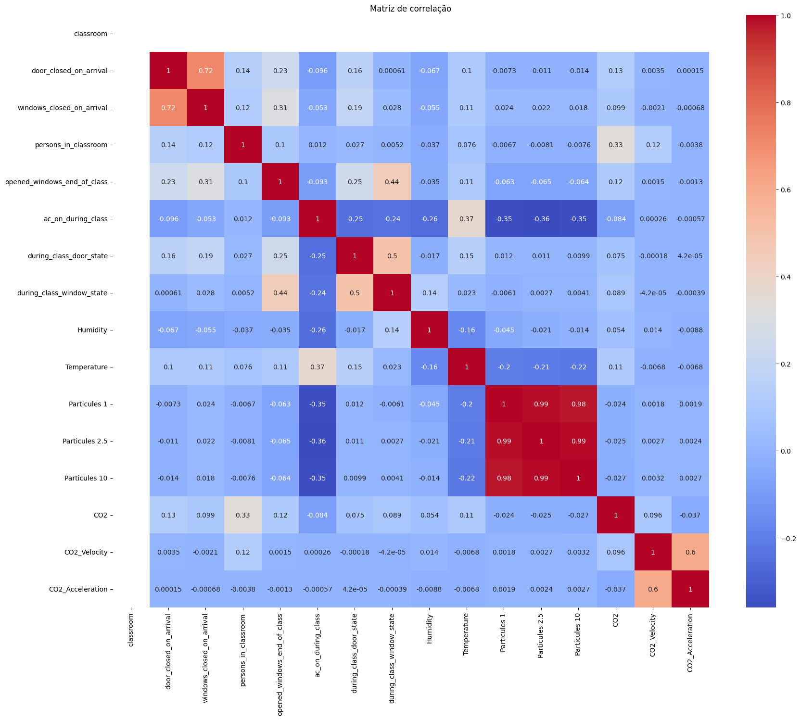
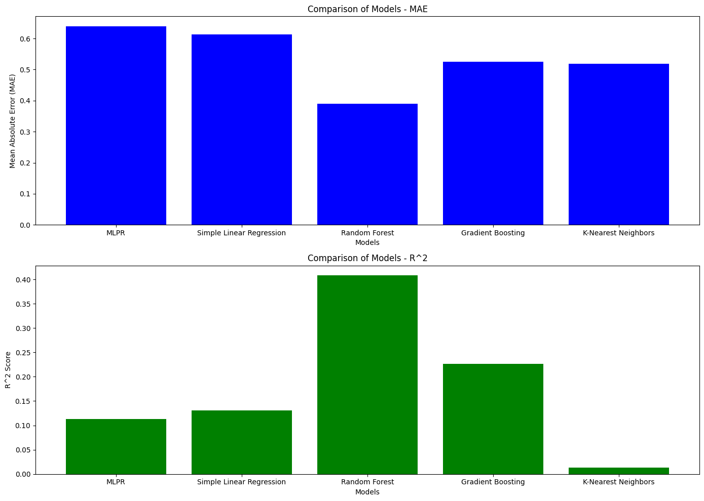

# Tema 2: Timeseries e análise de dados de sensores (CO2, temperatura, humidade, ppm)

## Introdução
Este relatório apresenta uma análise detalhada dos modelos de regressão utilizados para prever a ocupação em salas de aula com base em dados de qualidade do ar, mais especificamente focando-se na concentração de CO2, temperatura e humidade.O principal objetivo da análise focada destes resultados é investigar que modelo proporciona a melhor previsão de quantas pessoas se encontram dentro de uma sala, utilizando os dados acima referidos para a obtenção dessas mesmas previsões. O uso de diversos modelos facilita a comparação dos resultados face ao tipo de dados, permitindo assim tirar conclusões relativamente ao modelo com maior precisão, sendo capaz, também, de explicar as variações dos dados.

## Descrição do Problema
O problema abordado consiste em prever o número de pessoas presentes em salas de aula usando sensores que medem o nível de dióxido de carbono (CO2), temperatura e humidade. A correlação entre estes indicadores e a ocupação é essencial para que se possam verificar padrões, de modo a que se possa melhorar a ventilação e garantir um ambiente saudável para os ocupantes das salas.

## Estado da arte
A previsão da ocupação em ambientes fechados é um campo de estudo ativo, com diversas abordagens utilizando técnicas de *machine learning* e análise de dados. Modelos de regressão como regressão linear, *random forest* e *gradient descent*, são frequentemente utilizados deviso à sua capacidade de lidar com dados complexos e não lineares. Estudos anteriores já comprovaram que a concentração de CO2 é um forte indicador de presença humana, podendo por isso, ser utilizado como uma variável vital para os modelos de previsão.

## Desenvolvimento

Foram utilizados 5 modelos de regressão para prever a ocupação com base nos dados analisados:
- Regressão Linear;
- *Random Forest*;
- *MLPRegressor*;
- Suporte Vetorial de Regressão (SVR);
-  K-Nearest Neighbors (KNN).

Desta lista de modelos escolhida, nem todos foram lecionados durante a aula teórica mas, após pesquisar, foram escolhidos devido à sua capacidade de lidar com dados complexos e os resultados obtidos.
Para que estes desenvolvimentos sejam possíveis foram usadas as seguintes bibliotecas:
- Pandas;
- Scikit-Learn;
- Matplotlib;
- Seaborn.

Os passos principais são:
- **Escolha dos dados e análise dos mesmos**: Utilizam-se conjuntos de dados de diferentes salas (106, 204, 210) onde foi feito o estudo usando os sensores na Universidade Fernando Pessoa e os dados obtidos dos sensores implementados na escola secundária de Alpendorada;
- **Formatação dos dados**: Após obter os dados obtidos via sensores resta apenas selecionar as variáveis mais relevantes para o estudo que se pretende fazer;

- **Modelos Avaliados**: O passo lógico seguinte passou por escolher alguns modelos relevantes para comparar os resultados:
	- **MLPRegressor (Multi-layer Perceptron Regressor)**: Rede neural com várias camadas ocultas para aprendizagem profunda de padrões nos dados (a sua performance foi limitada de modo a manter o tempo de execução dentro dos limites, comparativamente com os outros modelos, tornando o resultado obtido não tão bom como se poderia obter);
	- **Regressão Linear Simples**: Modelo linear básico de modo a establecer uma linha de base;
	- **Random Forest Regressor**: Modelo de floresta aleatória no qual se pretendem captar relações não-lineares e as interações entre variáveis;
	- **Gradient Boosting**: Modelo que combina várias árvores de decisão consideradas de desempenho individual baixo e cria um modelo de alto desempenho;
	- **K-Nearest Neighbors Regressor**: Modelo baseado em vizinhos mais próximos com o objetivo de capturar padrões locais nos dados.
- **Implementação e Avaliação dos Modelos**: 
	- Cada um dos modelos foi treinado usado os dados de treino e avaliado usando métricas como Erro Médio Absoluto (MAE) e o Coeficiente de Determinação (R^2);
	- Foram geradas matrizes, gráficos e tabelas de modo a que a visualização e comparação dos resultados de cada modelo seja mais simples, fornecendo *insights* sobre a precisão dos modelos.

## Análise de resultados

Para a obtenção destes valores foi usado o dataset baseado nos valores obtidos na sala 106 da Universidade Fernando Pessoa.

| Modelo                    | *MAE*    | *R^2*    |
|--------------------------|--------|--------|
| MLPR                     | 0.6394| 0.1134|
| Simple Linear Regression | 0.6134| 0.1312|
| Random Forest            | 0.3907| 0.4079|
| Gradient Boosting        | 0.5248| 0.2260|
| K-Nearest Neighbors      | 0.5188| 0.0133|
 
 Através destes resultados, pode concluir-se que o modelo com melhor desempenho é o *Random Forest*. Este tem o menor valor de *MAE* e o maior *R^2* entre todos os modelos testados, indicando uma capacidade de previsão superior em comparação com os outros modelos usados. Para este conjunto de dados específicos, o *Random Forest* é o modelo recomnedado de modo a obter valores mais precisos no que toca à previsão dos níveis de ocupação.

## Conclusão

Com base nos resultados, é possível concluir que o modelo *Random Forest Regressor* é o mais adequado para obter dados de CO2, temperatura e humidade, baseado nos *datasets* usados. Para futuros desenvolvimentos pretende-se utilizar modelos de séries temporais ou redes neuronais recorrentes com o objetivo de capturar melhor a dinâmica temporal dos dados.

## Links

- [Google Colab](https://colab.research.google.com/drive/1-6_K8W8MbyS-GCwVMZ-MxvU_VLHSgUGl?usp=sharing)
- [GitHub](https://github.com/beatrizleite/IA-Proj)
